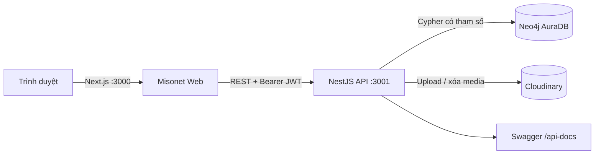
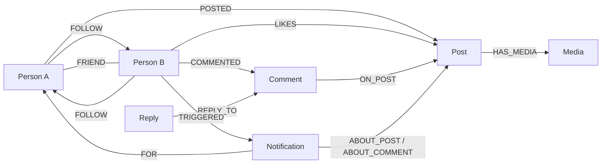

# Misonet — Mini Social Network

Misonet là mạng xã hội thu nhỏ xây dựng theo mô hình graph. Dữ liệu người dùng, quan hệ theo dõi, bạn bè, bài viết và tương tác được lưu trên Neo4j; frontend sử dụng Next.js và backend sử dụng NestJS.

Ứng dụng tập trung vào trải nghiệm kết nối tự nhiên: tạo hồ sơ, theo dõi người khác, kết bạn khi hai người cùng theo dõi nhau, đăng bài theo phạm vi riêng tư, tương tác, nhận thông báo và khám phá bạn chung. Phân hệ quản trị hỗ trợ kiểm duyệt nội dung, xử lý báo cáo và theo dõi toàn bộ thao tác bằng audit log.

## Mục lục

- [Tính năng](#tính-năng)
- [Công nghệ và kiến trúc](#công-nghệ-và-kiến-trúc)
- [Cấu trúc dự án](#cấu-trúc-dự-án)
- [Yêu cầu hệ thống](#yêu-cầu-hệ-thống)
- [Chạy local](#chạy-local)
- [Dữ liệu và tài khoản demo](#dữ-liệu-và-tài-khoản-demo)
- [Mô hình dữ liệu graph](#mô-hình-dữ-liệu-graph)
- [API chính](#api-chính)
- [Phân hệ quản trị](#phân-hệ-quản-trị)
- [Kiểm thử](#kiểm-thử)
- [CI/CD và triển khai](#cicd-và-triển-khai)
- [Bảo mật và giới hạn hiện tại](#bảo-mật-và-giới-hạn-hiện-tại)
- [Xử lý lỗi thường gặp](#xử-lý-lỗi-thường-gặp)

## Tính năng

### Người dùng và xác thực

- Đăng ký, đăng nhập và xác thực bằng JWT.
- Biểu mẫu đăng ký có xác nhận mật khẩu; ô mật khẩu hỗ trợ ẩn/hiện nội dung.
- Mật khẩu dài từ 8 đến 128 ký tự và chỉ nhận ký tự in được trên bàn phím tiếng Anh.
- Chỉnh sửa họ tên, giới thiệu, nơi sinh sống, sở thích, ảnh đại diện và quyền riêng tư.
- Tìm kiếm người dùng, xem hồ sơ, người theo dõi, đang theo dõi và bạn bè.
- Optimistic UI cho thao tác theo dõi/bỏ theo dõi để giao diện phản hồi ngay.

### Quan hệ xã hội

- Quan hệ `FOLLOW` có hướng.
- Khi A theo dõi B và B theo dõi A, hệ thống tự tạo một quan hệ `FRIEND` duy nhất.
- Khi một bên bỏ theo dõi, quan hệ bạn bè được gỡ nhưng chiều theo dõi còn lại vẫn được giữ.
- Gợi ý bạn bè dựa trên bạn chung bằng truy vấn Cypher.

### Bài viết và tương tác

- Tạo, sửa và xóa bài viết.
- Ba phạm vi hiển thị: `PUBLIC`, `FRIENDS`, `PRIVATE`.
- Đăng ảnh hoặc video qua Cloudinary.
- Thích/bỏ thích bài viết.
- Bình luận, trả lời bình luận, sửa và xóa nội dung do mình tạo.
- Chia sẻ ra ứng dụng khác bằng Web Share API hoặc sao chép liên kết; không hiển thị bộ đếm lượt chia sẻ.
- Feed áp dụng quyền riêng tư và trạng thái kiểm duyệt trước khi trả dữ liệu.

### Thông báo và báo cáo

- Thông báo hoạt động, số thông báo chưa đọc, đánh dấu từng thông báo hoặc tất cả là đã đọc.
- Báo cáo người dùng, bài viết hoặc bình luận theo các lý do được hỗ trợ.
- Quản trị viên có thể mở báo cáo để xem trực tiếp nội dung bài viết/bình luận liên quan trước khi xử lý.

### Quản trị

- Dashboard thống kê user, post, comment, report, follow, friend và like.
- Tìm kiếm, lọc và phân trang danh sách người dùng.
- Tạm ngưng, mở tạm ngưng, cấm và mở cấm tài khoản.
- Ẩn, gỡ hoặc khôi phục bài viết và bình luận.
- Tiếp nhận, phân công, xem xét, giải quyết hoặc từ chối báo cáo.
- Quản lý vai trò `USER`/`ADMIN`; chỉ `ADMIN` được truy cập.
- Audit log cho mọi thao tác quản trị.
- Tổng quan graph: tài khoản nhiều follower, nhiều bạn, nhiều like và nhiều báo cáo.
- Giao diện quản trị tại `/admin` theo phong cách đen trắng của Misonet.

## Công nghệ và kiến trúc

| Thành phần | Công nghệ |
| --- | --- |
| Frontend | Next.js 16 App Router, React 19, TypeScript, Tailwind CSS 4 |
| State và form | TanStack Query, React Hook Form, Zod |
| UI | Radix UI, Lucide, next-themes, Sonner |
| Backend | NestJS 11, TypeScript, Passport/JWT, Argon2, class-validator, Swagger |
| Database | Neo4j AuraDB, Cypher có tham số |
| Media | Cloudinary |
| Production | Vercel (web), Railway (API), GitHub Actions (CI/CD) |



Backend luôn truyền dữ liệu người dùng bằng Cypher parameters, không nối chuỗi trực tiếp vào truy vấn. Các truy vấn quản trị được tách riêng tại `apps/api/src/admin/cypher` để dễ kiểm tra, tối ưu và kiểm thử.

## Cấu trúc dự án

```text
mini-social-network/
├── .github/workflows/ci-cd.yml   # CI và deploy production
├── apps/
│   ├── api/                      # NestJS API
│   │   ├── src/admin/            # Quản trị và Cypher quản trị
│   │   ├── src/auth/             # Xác thực và phân quyền
│   │   ├── src/notifications/    # Thông báo
│   │   ├── src/posts/            # Bài viết và bình luận
│   │   ├── src/reports/          # Báo cáo người dùng
│   │   ├── src/seed/             # Seed, schema và cấp quyền admin
│   │   └── src/users/            # Hồ sơ người dùng
│   └── web/                      # Next.js frontend
│       └── src/app/              # App Router và các trang giao diện
├── docs/demo-script.md           # Kịch bản trình diễn
├── scripts/smoke-deployment.mjs  # Smoke test production
├── DEPLOYMENT.md                 # Hướng dẫn triển khai chi tiết
└── TESTING.md                    # Ma trận kiểm thử
```

Hai ứng dụng là hai project pnpm độc lập. Chạy lệnh cài đặt trong từng thư mục `apps/api` và `apps/web`.

## Yêu cầu hệ thống

- Node.js `22.x` (API yêu cầu từ `22.13` đến dưới `23`).
- pnpm `11.18.0`.
- Một Neo4j AuraDB database dùng URI `neo4j+s://`.
- Một tài khoản Cloudinary nếu cần upload ảnh/video.

Kiểm tra phiên bản:

```powershell
node --version
pnpm --version
```

## Chạy local

### 1. Tạo file môi trường

Từ thư mục gốc:

```powershell
Copy-Item apps/api/.env.example apps/api/.env
Copy-Item apps/web/.env.example apps/web/.env.local
```

Cấu hình backend trong `apps/api/.env`:

```dotenv
PORT=3001
FRONTEND_URL=http://localhost:3000

NEO4J_URI=neo4j+s://YOUR_INSTANCE_ID.databases.neo4j.io
NEO4J_USERNAME=neo4j
NEO4J_PASSWORD=YOUR_AURA_PASSWORD
NEO4J_DATABASE=neo4j

JWT_SECRET=replace_with_a_random_secret_of_at_least_32_characters
JWT_EXPIRES_IN=30m

CLOUDINARY_CLOUD_NAME=YOUR_CLOUD_NAME
CLOUDINARY_API_KEY=YOUR_API_KEY
CLOUDINARY_API_SECRET=YOUR_API_SECRET
```

Cấu hình frontend trong `apps/web/.env.local`:

```dotenv
NEXT_PUBLIC_API_URL=http://localhost:3001
NEXT_PUBLIC_SITE_URL=http://localhost:3000
```

Không commit `.env`, `.env.local`, mật khẩu Neo4j, JWT secret hoặc Cloudinary secret.

### 2. Cài đặt dependency

```powershell
Set-Location apps/api
pnpm install --frozen-lockfile

Set-Location ../web
pnpm install --frozen-lockfile
```

### 3. Khởi tạo schema Neo4j

```powershell
Set-Location apps/api
pnpm schema:setup
```

Lệnh này tạo constraint, property index, composite index, full-text index và bổ sung trạng thái moderation mặc định cho dữ liệu cũ. Lệnh có tính idempotent nên có thể chạy lại an toàn.

### 4. Khởi động API và web

Mở hai terminal riêng.

Terminal API:

```powershell
Set-Location apps/api
pnpm start:dev
```

Terminal web:

```powershell
Set-Location apps/web
pnpm dev
```

| Dịch vụ | Địa chỉ |
| --- | --- |
| Web | http://localhost:3000 |
| API | http://localhost:3001 |
| Swagger | http://localhost:3001/api-docs |
| Health | http://localhost:3001/health |
| Neo4j health | http://localhost:3001/health/graph |

## Dữ liệu và tài khoản demo

Chạy seed trong `apps/api`:

```powershell
pnpm seed
```

Seed sử dụng `MERGE` và mã định danh có tiền tố `DEMO-`, vì vậy có thể chạy lại mà không nhân đôi dữ liệu chính. Bộ dữ liệu gồm:

- 42 tài khoản demo.
- 54 bài viết gốc.
- Quan hệ follow hai chiều và friend được suy ra.
- Like, comment, reply, repost và notification.
- 30 tài khoản mở rộng dùng avatar `https://i.pravatar.cc/150?img=1` đến `img=20` theo vòng lặp.
- Dữ liệu riêng tư không được tạo tương tác trái quyền từ người khác.

Tài khoản dùng để thử local/demo:

| Trường | Giá trị |
| --- | --- |
| Username | `demo.an.nguyen` |
| Password | `MisonetDemo@2026` |
| Role | `ADMIN` |

Tài khoản này có thể truy cập `/admin`. Chỉ sử dụng mật khẩu demo trong môi trường local hoặc dữ liệu trình diễn.

Cấp quyền admin cho một tài khoản có sẵn:

```powershell
pnpm admin:promote -- ten_dang_nhap
```

## Mô hình dữ liệu graph



| Node/quan hệ | Thuộc tính tiêu biểu |
| --- | --- |
| `Person` | `personId`, `username`, `email`, `passwordHash`, `fullName`, `avatarUrl`, `isPrivate`, `role`, `accountStatus` |
| `Post` | `postId`, `content`, `privacy`, `moderationStatus`, `moderationReason`, timestamps |
| `Comment` | `commentId`, `content`, `moderationStatus`, `moderationReason`, timestamps |
| `Media` | `mediaId`, `publicId`, `secureUrl`, `resourceType`, kích thước và dung lượng |
| `Notification` | `notificationId`, `notificationKey`, `type`, `readAt`, `createdAt` |
| `Report` | `reportId`, target, reason, status, người xử lý và timestamps |
| `AuditLog` | actor, action, target, note, snapshot trước/sau và thời gian |
| `FOLLOW` | `followedAt` |
| `FRIEND` | `since`, `source: "MUTUAL_FOLLOW"` |
| `LIKES` | `likedAt`, `reaction: "LIKE"` |

Ví dụ truy vấn gợi ý bạn bè qua bạn chung:

```cypher
MATCH (me:Person {personId: $currentPersonId})
      -[:FRIEND]-(mutualFriend:Person)
      -[:FRIEND]-(candidate:Person)
WHERE candidate <> me
  AND NOT EXISTS { MATCH (me)-[:FRIEND]-(candidate) }
WITH me, candidate,
     count(DISTINCT mutualFriend) AS mutualFriendCount,
     collect(DISTINCT {
       personId: mutualFriend.personId,
       username: mutualFriend.username,
       fullName: mutualFriend.fullName
     }) AS mutualFriends
RETURN candidate, mutualFriendCount, mutualFriends,
       EXISTS { MATCH (me)-[:FOLLOW]->(candidate) } AS isFollowing,
       EXISTS { MATCH (candidate)-[:FOLLOW]->(me) } AS isFollowedBy
ORDER BY mutualFriendCount DESC, candidate.fullName ASC, candidate.personId ASC
LIMIT $limit
```

## API chính

Ngoại trừ đăng ký, đăng nhập và health check, các endpoint yêu cầu header:

```http
Authorization: Bearer <access_token>
```

| Nhóm | Endpoint tiêu biểu |
| --- | --- |
| Auth | `POST /auth/register`, `POST /auth/login`, `GET /auth/me` |
| Profile | `GET /users/me`, `PATCH /users/me`, `GET /users/:username`, `GET /users/search` |
| Social | `POST/DELETE /users/:personId/follow`, các route followers/following/friends và relationship status |
| Posts | `POST /posts`, `GET /posts/feed`, `GET /posts/:postId`, `PATCH/DELETE /posts/:postId` |
| Likes/reposts | `POST/DELETE /posts/:postId/like`, `POST/DELETE /posts/:postId/repost` |
| Comments | `POST/GET /posts/:postId/comments`, `PATCH/DELETE /posts/:postId/comments/:commentId` |
| Uploads | `POST /uploads/post-media`, `POST /uploads/profile-avatar` |
| Suggestions | `GET /recommendations/friends?limit=10` |
| Notifications | `GET /notifications`, unread count, mark read và mark all |
| Reports | `POST /reports` |
| Admin | `/admin/overview`, `/admin/users`, `/admin/content`, `/admin/reports`, `/admin/graph-overview`, `/admin/audit-logs` |

Swagger tại `/api-docs` là nguồn tham khảo đầy đủ cho DTO, tham số và response hiện hành.

### Media

Upload bài viết nhận JPG/PNG/WebP tối đa 10 MB hoặc MP4/WebM/MOV tối đa 50 MB. Avatar nhận JPG/PNG/WebP tối đa 10 MB. Cloudinary lưu binary; Neo4j chỉ lưu URL và metadata.

```powershell
curl.exe -X POST http://localhost:3001/uploads/post-media `
  -H "Authorization: Bearer YOUR_TOKEN" `
  -F "file=@C:\path\photo.webp"
```

## Phân hệ quản trị

Phân hệ admin được bảo vệ bởi JWT guard và `AdminGuard`. Role và trạng thái tài khoản được đọc lại từ Neo4j trên mỗi request, vì vậy `SUSPENDED` hoặc `BANNED` có hiệu lực ngay cả khi access token cũ chưa hết hạn.

Các state machine chính:

```text
Account:    ACTIVE ↔ SUSPENDED, ACTIVE/SUSPENDED ↔ BANNED
Content:    VISIBLE ↔ HIDDEN ↔ REMOVED
Report:     PENDING → IN_REVIEW → RESOLVED | REJECTED
```

- Moderation là soft action: dữ liệu được giữ lại để phục vụ bằng chứng và có thể khôi phục.
- Chỉ admin được phân công mới có thể kết thúc report.
- Chi tiết report trả về target preview để quản trị viên mở bài viết hoặc bình luận bị báo cáo.
- Mọi mutation quản trị tạo `AuditLog` với actor, target, ghi chú và snapshot trước/sau.
- Dashboard sử dụng Cypher subquery để tránh Cartesian product khi đếm nhiều loại node/relationship.
- List endpoint giới hạn tối đa 100 bản ghi mỗi trang; recommendation giới hạn tối đa 50.

## Kiểm thử

### API

```powershell
Set-Location apps/api
pnpm lint
pnpm test --runInBand
pnpm test:e2e --runInBand
pnpm test:cov --runInBand
pnpm cypher:validate-admin
pnpm build
```

### Web

```powershell
Set-Location apps/web
pnpm lint
pnpm build
```

Ma trận kiểm thử chi tiết, số lượng case và phạm vi bao phủ nằm trong [TESTING.md](TESTING.md). Kịch bản kiểm tra thủ công phục vụ demo nằm trong [docs/demo-script.md](docs/demo-script.md).

## CI/CD và triển khai

Workflow tại `.github/workflows/ci-cd.yml` chạy khi có pull request hoặc push lên `master`/`main`:

1. Cài dependency bằng lockfile.
2. Lint, test và build API.
3. Lint và build web.
4. Chỉ khi toàn bộ CI đạt, API được deploy lên Railway và web được deploy lên Vercel.

`git commit` chỉ lưu thay đổi trên máy local. Deployment bắt đầu sau khi commit được `git push` lên production branch và GitHub Actions nhận sự kiện push. Repository hiện dùng `master` làm production branch.

Các GitHub Actions secrets cần có:

```text
RAILWAY_TOKEN
RAILWAY_PROJECT_ID
RAILWAY_SERVICE_ID
RAILWAY_ENVIRONMENT_ID
VERCEL_TOKEN
VERCEL_ORG_ID
VERCEL_PROJECT_ID
```

Hướng dẫn thiết lập Railway, Vercel, AuraDB, Cloudinary, environment và smoke test production nằm trong [DEPLOYMENT.md](DEPLOYMENT.md).

## Bảo mật và giới hạn hiện tại

- Password được hash bằng Argon2 và không xuất hiện trong response API.
- Input được kiểm tra bằng `class-validator`; API dùng global validation pipe.
- Cypher sử dụng parameters để hạn chế injection.
- API không trả email hoặc dữ liệu nhạy cảm trong kết quả tìm kiếm công khai.
- Profile riêng tư chỉ cho chủ tài khoản xem danh sách kết nối; người khác nhận `403`.
- Access token hiện được frontend lưu trong `localStorage`. Cách này phù hợp cho đồ án/demo nhưng production dài hạn nên chuyển sang cookie `HttpOnly`, `Secure`, `SameSite`, refresh-token rotation và CSP chặt chẽ.
- Không đưa secret vào biến `NEXT_PUBLIC_*`, vì các biến này được nhúng vào bundle frontend lúc build.

## Xử lý lỗi thường gặp

### API không kết nối được Neo4j

- Kiểm tra `NEO4J_URI` có dùng `neo4j+s://`.
- Kiểm tra username, password, database và trạng thái AuraDB.
- Mở `http://localhost:3001/health/graph` để xác minh truy vấn graph.

### Frontend gọi sai API

- Local: `NEXT_PUBLIC_API_URL=http://localhost:3001`.
- Production: dùng domain HTTPS của Railway và không thêm `/api` ở cuối.
- Khởi động lại Next.js sau khi thay đổi `.env.local`.

### Upload media thất bại

- Kiểm tra đủ ba biến Cloudinary.
- Kiểm tra định dạng và giới hạn dung lượng file.
- Xem log API để phân biệt lỗi validation với lỗi từ Cloudinary.

### Không vào được `/admin`

- Xác nhận tài khoản có `role: ADMIN` và `accountStatus: ACTIVE`.
- Chạy `pnpm admin:promote -- ten_dang_nhap` trong `apps/api` nếu cần cấp quyền.
- Đăng nhập lại nếu giao diện đang giữ thông tin phiên cũ.

---

Tài liệu liên quan: [triển khai](DEPLOYMENT.md) · [kiểm thử](TESTING.md) · [kịch bản demo](docs/demo-script.md)
