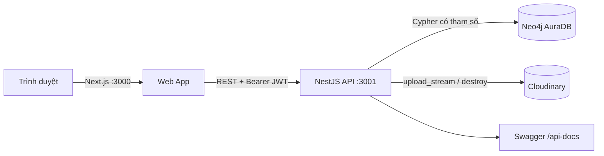
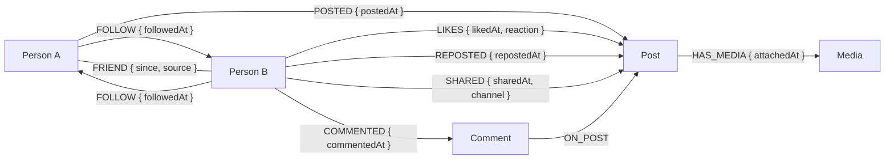

# Misonet — Mini Social Network

Hướng dẫn production cho Vercel, Railway, AuraDB, Cloudinary và GitHub Actions nằm tại [DEPLOYMENT.md](DEPLOYMENT.md).

Misonet là mạng xã hội thu nhỏ dùng Neo4j làm cơ sở dữ liệu nghiệp vụ chính. Ứng dụng hỗ trợ xác thực JWT, hồ sơ cá nhân, follow hai chiều để suy ra quan hệ bạn bè, bài viết có quyền riêng tư, media Cloudinary, like, news feed và gợi ý “bạn của bạn” bằng Cypher.

## Kiến trúc



| Thành phần | Công nghệ |
| --- | --- |
| Frontend | Next.js App Router, React, TypeScript, Tailwind CSS, TanStack Query, React Hook Form, Zod |
| Backend | NestJS, TypeScript, JWT/Passport, Argon2, Multer, Cloudinary, class-validator, Swagger |
| Database | Neo4j AuraDB, Cypher |
| Giao diện | Radix primitives, Lucide, next-themes, Sonner |

## Mô hình graph



| Node / quan hệ | Thuộc tính chính |
| --- | --- |
| `Person` | `personId`, `username`, `email`, `passwordHash`, `fullName`, `bio`, `avatarUrl`, `isPrivate`, `createdAt`, `updatedAt` |
| `Post` | `postId`, `content`, `imageUrl`, `privacy`, `createdAt`, `updatedAt` |
| `Media` | `mediaId`, `publicId`, `secureUrl`, `resourceType`, `format`, `width`, `height`, `duration`, `bytes`, `createdAt` |
| `Comment` | `commentId`, `content`, `createdAt`, `updatedAt` |
| `FOLLOW` | `followedAt` |
| `FRIEND` | `since`, `source: "MUTUAL_FOLLOW"` |
| `POSTED` | `postedAt` |
| `LIKES` | `likedAt`, `reaction: "LIKE"` |
| `COMMENTED` / `ON_POST` | tác giả comment và bài viết nhận comment |
| `REPOSTED` | `repostedAt` |
| `SHARED` | `sharedAt`, `channel: "COPY" | "NATIVE"` |
| `HAS_MEDIA` | `attachedAt` |

Không có API tạo `FRIEND` trực tiếp. Khi A follow B và B follow A, backend tạo đúng một cạnh `FRIEND`, theo hướng ổn định từ `personId` nhỏ đến lớn. Khi một chiều bị unfollow, cạnh `FRIEND` bị xóa nhưng cạnh `FOLLOW` chiều ngược lại được giữ nguyên.

## Cấu hình môi trường

Yêu cầu Node.js 20+, pnpm và một Neo4j AuraDB database.

```powershell
Copy-Item apps/api/.env.example apps/api/.env
Copy-Item apps/web/.env.example apps/web/.env.local
```

Điền thông tin AuraDB, một `JWT_SECRET` mạnh và ba biến `CLOUDINARY_CLOUD_NAME`, `CLOUDINARY_API_KEY`, `CLOUDINARY_API_SECRET` trong `apps/api/.env`. Không đưa file `.env`, mật khẩu AuraDB, JWT secret hoặc Cloudinary API secret vào Git. Frontend chỉ cần `NEXT_PUBLIC_API_URL`; tuyệt đối không đặt credentials backend trong biến `NEXT_PUBLIC_*`.

## Chạy dự án

Mở hai terminal:

```powershell
Set-Location apps/api
pnpm install
pnpm start:dev
```

```powershell
Set-Location apps/web
pnpm install
pnpm dev
```

- Web: `http://localhost:3000`
- API: `http://localhost:3001`
- Swagger: `http://localhost:3001/api-docs`
- Health: `http://localhost:3001/health`
- Neo4j health: `http://localhost:3001/health/graph`

## Tài khoản và dữ liệu demo

Seed chính thức tạo dữ liệu có tiền tố `DEMO-` và dùng `MERGE`, vì vậy có thể chạy lại mà không nhân đôi dữ liệu:

```powershell
Set-Location apps/api
pnpm seed
```

Seed gồm 12 tài khoản, 24 bài viết, mạng follow hai chiều để suy ra friend, cùng like, comment, repost và share. Nội dung riêng tư không được seed tương tác từ người khác. Tài khoản thử: `demo.an.nguyen`, mật khẩu `MisonetDemo@2026`. Chỉ dùng mật khẩu này cho dữ liệu local/demo, không dùng ở production.

## API chính

Tất cả endpoint trừ register, login và health yêu cầu `Authorization: Bearer <token>`.

| Nhóm | Endpoint |
| --- | --- |
| Auth | `POST /auth/register`, `POST /auth/login`, `GET /auth/me` |
| Profile | `GET /users/me`, `PATCH /users/me`, `GET /users/:username`, `GET /users/search?q=...` |
| Social | `POST/DELETE /users/:personId/follow`, `GET /users/me/followers`, `GET /users/me/following`, `GET /users/me/friends`, `GET /users/:username/followers`, `GET /users/:username/following`, `GET /users/:username/friends`, `GET /users/:personId/relationship-status` |
| Posts | `POST /posts`, `GET /posts/feed`, `GET /posts/user/:username`, `GET/PATCH/DELETE /posts/:postId`, `POST/DELETE /posts/:postId/like`, `POST/DELETE /posts/:postId/repost`, `POST /posts/:postId/share` |
| Comments | `POST/GET /posts/:postId/comments`, `PATCH/DELETE /posts/:postId/comments/:commentId` |
| Uploads | `POST /uploads/post-media`, `POST /uploads/profile-avatar` (`multipart/form-data`, field `file`) |
| Suggestions | `GET /recommendations/friends?limit=10` |

List endpoint dùng pagination giới hạn tối đa 100; recommendations giới hạn tối đa 50. Post hỗ trợ `PUBLIC`, `FRIENDS`, `PRIVATE`. Người dùng chọn file trực tiếp từ máy; giao diện không nhận URL media thủ công. Upload bài viết nhận JPG/PNG/WebP tối đa 10 MB hoặc MP4/WebM/MOV tối đa 50 MB trong `misonet/posts`; avatar nhận JPG/PNG/WebP tối đa 10 MB trong `misonet/avatars`. Cloudinary lưu binary; Neo4j chỉ lưu URL và metadata, không lưu binary/Base64.

Khi `Person.isPrivate = true`, chỉ chính chủ được gọi API xem friends, followers và following của profile đó; người dùng khác nhận `403`. Profile riêng tư vẫn xuất hiện trong tìm kiếm để có thể gửi follow, nhưng API search không trả email hoặc dữ liệu nhạy cảm.

Luồng tạo bài có media:

1. Gửi file tới `POST /uploads/post-media` với Bearer token.
2. Nhận `publicId`, `secureUrl`, `resourceType`, `format`, kích thước/duration và `bytes`.
3. Gửi object đó trong field `media` của `POST /posts`. Backend tạo `Post`, `Media` và `HAS_MEDIA` trong cùng Cypher write.
4. Khi xóa post, backend xóa Cloudinary asset bằng `publicId`, sau đó xóa `Media/HAS_MEDIA/Post`.

```powershell
curl.exe -X POST http://localhost:3001/uploads/post-media `
  -H "Authorization: Bearer YOUR_TOKEN" `
  -F "file=@C:\path\photo.webp"
```

## Cypher gợi ý bạn bè

```cypher
MATCH (me:Person {personId: $currentPersonId})
      -[:FRIEND]-(mutualFriend:Person)
      -[:FRIEND]-(candidate:Person)
WHERE candidate <> me
  AND NOT EXISTS { MATCH (me)-[:FRIEND]-(candidate) }
WITH me, candidate,
     count(DISTINCT mutualFriend) AS mutualFriendCount,
     collect(DISTINCT {
       personId: mutualFriend.personId,
       username: mutualFriend.username,
       fullName: mutualFriend.fullName
     }) AS mutualFriends
RETURN candidate, mutualFriendCount, mutualFriends,
       EXISTS { MATCH (me)-[:FOLLOW]->(candidate) } AS isFollowing,
       EXISTS { MATCH (candidate)-[:FOLLOW]->(me) } AS isFollowedBy
ORDER BY mutualFriendCount DESC, candidate.fullName ASC, candidate.personId ASC
LIMIT $limit
```

Mọi giá trị từ client đều được truyền bằng Cypher parameters. API ánh xạ Neo4j Node/Integer/DateTime sang JSON an toàn và không trả `passwordHash`.

## Kiểm thử

```powershell
Set-Location apps/api
pnpm lint
pnpm test --runInBand
pnpm build

Set-Location ../web
pnpm lint
pnpm build
```

Unit tests bao phủ auth/profile, mutual follow, unfollow, quyền bài viết, like idempotency, privacy feed và thứ tự recommendation. Checklist smoke test và kịch bản thuyết trình nằm tại [docs/demo-script.md](docs/demo-script.md).

## Lưu ý bảo mật

Phiên bản đồ án dùng Bearer token trong `localStorage` vì API hiện trả access token trong JSON. Đây là lựa chọn đơn giản cho demo nhưng dễ bị ảnh hưởng bởi XSS; production nên chuyển sang cookie `HttpOnly`, `Secure`, `SameSite`, thêm refresh-token rotation và CSP chặt chẽ.
